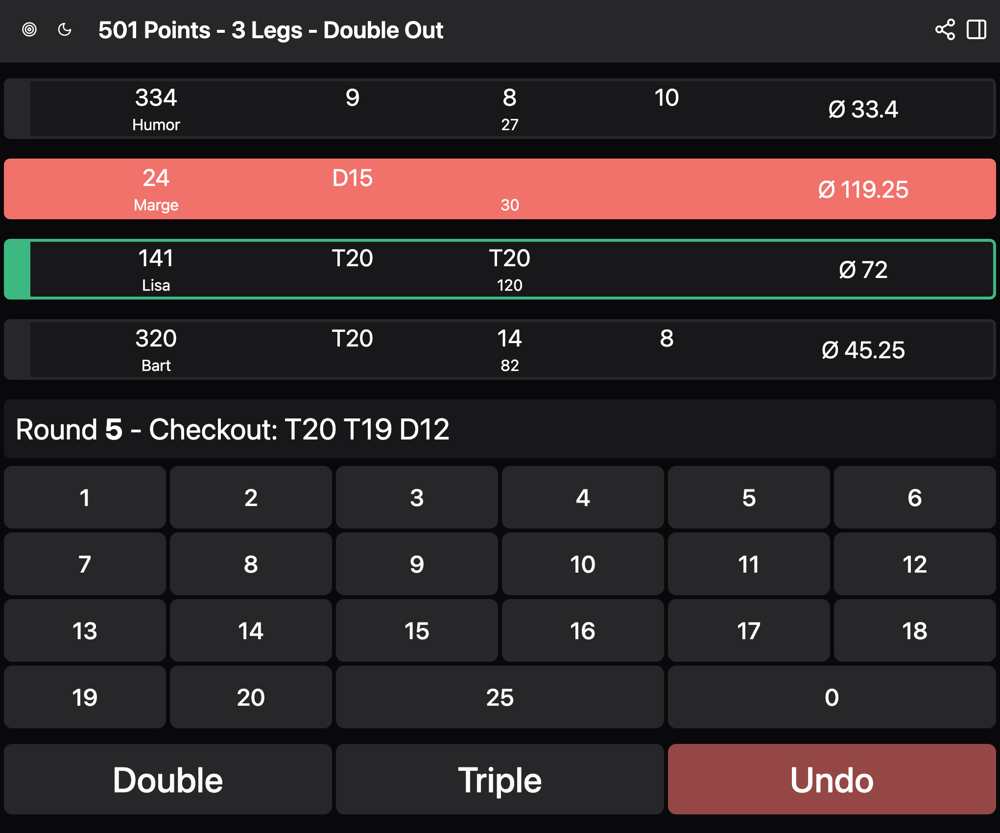

# 🎯 Dart Scoreboard 

Dart Scoreboard is a web application for managing and displaying scores during a game of darts. Built with Next.js, the project was bootstrapped using `create-next-app`.

## Features

- 🎯 Score Tracking: Easily input and update scores during gameplay.
- 🖥️ User-Friendly Interface: Simple, intuitive UI designed for quick interaction.
- ⚡ Real-Time Updates: Automatically reflects changes to scores as they happen.

## Requirements

- [node.js](https://nodejs.org/en)
- [npm](https://npmjs.com/)
- [docker](https://www.docker.com/)

## Getting Started

- Run `git clone https://github.com/mxwnk/dart-scoreboard.git` to get the repo
- Run `cp .env-example .env` to init local environment
- Run `npm install` to get all dependencies
- Run `npm run db:up` to start the postgresql db
- Run `npm run db:push` to migrate the db
- Run `npm run dev` to start dev environment

## Deployment

To create an optimized production build:

- Run `npm run build` 
- Run `npm run start`

